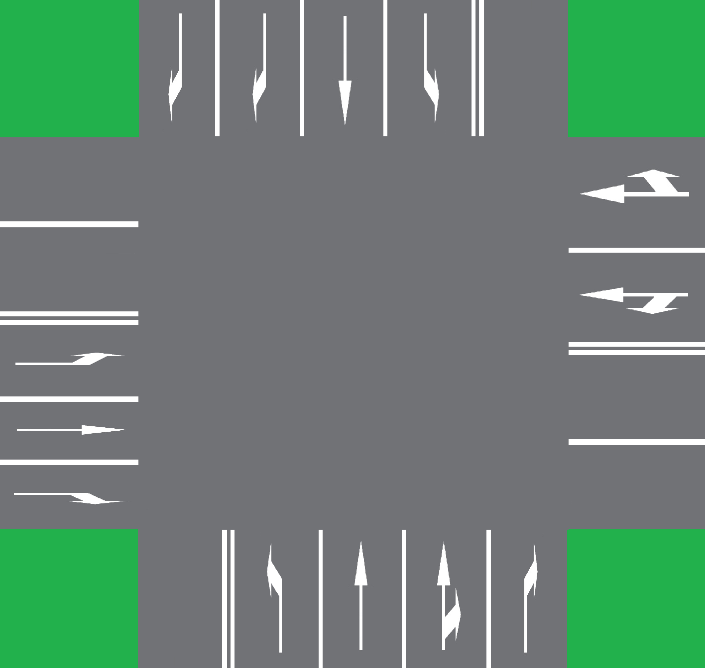

# Traffic Light Management

## Project description

> [!NOTE]
> This project is a recruitment task to AVSystems company.

This project simulates an intelligent traffic light system for a four-way crossing. The goal is to design and implement 
a system that dynamically adjusts the traffic light cycles based on traffic density on each road.

## Requirements

- **Realistic crossing Simulation**  
  Represents a four-way crossing with approaches from the north, south, east, and west.

- **Traffic Light Control**  
  Simulates standard traffic light cycles (green, yellow, red), including optional features like green arrows for turning lanes.

- **Conflict-Free Logic**  
  Ensures safety by avoiding conflicting green lights for directions that would intersect.

- **Vehicle Queue Tracking**  
  Keeps track of vehicles waiting at each road.

- **Command-Driven Simulation**  
  The simulation accepts commands in the form of a JSON file. Each command defines an action to be executed at the crossing.

### Supported Command Types

- ```addVehicle``` - Adds a vehicle to the simulation with a specified starting and ending road.

- ```step``` - Executes one simulation step. Vehicles from the direction with the green light will pass through the crossing.

### Output Structure

- ```stepStatuses``` - Contains list of statuses for each simulation step.

- ```leftVehicles``` - Contains list of Vehicle names, which passed through crossing during given step.

### JSON file structure 

#### Input

```json
{
  "commands": [
    {
      "type": "addVehicle",
      "vehicleId": "vehicle1",
      "startRoad": "south",
      "endRoad": "north"
    },
    {
      "type": "addVehicle",
      "vehicleId": "vehicle2",
      "startRoad": "north",
      "endRoad": "south"
    },
    {
      "type": "step"
    },
    {
      "type": "step"
    },
    {
      "type": "addVehicle",
      "vehicleId": "vehicle3",
      "startRoad": "west",
      "endRoad": "south"
    },
    {
      "type": "addVehicle",
      "vehicleId": "vehicle4",
      "startRoad": "west",
      "endRoad": "south"
    },
    {
      "type": "step"
    },
    {
      "type": "step"
    }
  ]
}
```

#### Expected output

```json
{
  "stepStatuses": [
    {
      "leftVehicles": [
        "vehicle1",
        "vehicle2"
      ]
    },
    {
      "leftVehicles": []
    },
    {
      "leftVehicles": [
        "vehicle3"
      ]
    },
    {
      "leftVehicles": [
        "vehicle4"
      ]
    }
  ]
}
```

## Implementation

In my implementation I allow multiple lanes on single road where each lane can handle multiple moves (turning right,
left or going straight). This approach provides more general and scalable solution that can be used to simulate lights
behaviour on any crossing.

To represent situation at crossing in code I have created classes ```TrafficLane```, ```Road```, ```Simulation```.

1. ```TrafficLane``` class representing traffic lane. Each traffic lane can support few moves (turning left, right or
   going straight).
2. ```Road``` class represents road. Each road has specific direction (north, east, south or west) and can have multiple
   traffic lanes.
3. ```Simulation``` class represents situation on the crossing. Simulation handles new vehicle arrival and traffic light
   switch.

### Idea

To minimize the total waiting time of vehicles in each simulation step, my algorithm selects the maximum number of 
vehicles that can pass through the crossing without collisions. Finding the maximum number of non-colliding vehicles is
done by utilizing the Bron-Kerbosch algorithm for finding the maximum weighted clique in a weighted graph, where vertices
are represented by lane types and edges represent the absence of collisions between lane types. The weight of each vertex
is the number of vehicles currently occupying the given lane type.

### Preparing Simulation

#### Example 1 - Roads with single Lanes

Let's assume there is a crossing as presented below:


To correctly represent this crossing we have to construct ```TrafficLane```, ```Road``` and ```Simulation``` objects as
follows:

##### TrafficLane

```java
Set<Move> allMoves = Set.of(Move.RIGHT, Move.STRAIGHT, Move.LEFT);
TrafficLane southLane = new TrafficLane(allMoves);

// similarly for remaining lanes...
```

##### Road

```java
Road southRoad = new Road(Direction.SOUTH, List.of(southLane));

// similarly for remaining roads...
```

##### Simulation

```java
// combine all roads to create simulation
Simulation simulation = new Simulation(List.of(northRoad, eastRoad, southRoad, westRoad));
```

#### Example 2 - Roads with multiple Lanes

Let's assume there is a crossing as presented below:



To correctly represent this crossing we have to construct ```TrafficLane```, ```Road``` and ```Simulation``` objects as 
follows:

##### TrafficLane

```java
TrafficLane southLaneLeft = new TrafficLane(Set.of(
        Move.LEFT
));

TrafficLane southLaneStraight = new TrafficLane(Set.of(
        Move.STRAIGHT
));

TrafficLane southLaneStraightRight = new TrafficLane(Set.of(
        Move.STRAIGHT,
        Move.RIGHT
));

TrafficLane southLaneRight = new TrafficLane(Set.of(
        Move.RIGHT
));

// similarly for remaining lanes...
```

##### Road

```java
Road southRoad = new Road(
        Direction.SOUTH, 
        List.of(
            southLaneLeft,
            southLaneStraight,
            southLaneStraightRight,
            southLaneRight
        )
);

// similarly for remaining roads...
```

##### Simulation

```java
// combine all roads to create simulation
Simulation simulation = new Simulation(List.of(northRoad, eastRoad, southRoad, westRoad));
```

### Running simulation with commands from JSON file and writing output

To run a prepared simulation with provided commands in a JSON file, the ```TrafficLightManager``` class can be used. This 
class provides the ```runManager()``` static method, which takes the path to the input JSON file with commands, the 
prepared simulation object, and the path to the output file that will contain information about the statuses of each step.

```java
public static void runManager(String pathToInputFile, String pathToOutputFile, Simulation simulation);
```

### Usage with CLI

#### Creating app 

To utilize commands from JSON file for simulation running:

1. Create a new class for the application
2. Prepare the simulation and call the ```runManager()``` method with specified paths to input and output files
inside your ```main()``` function.

#### Gradle setup
Inside the *build.gradle* file, if necessary, add the following lines to specify the main class of your application:

```groovy
plugins {
    id 'application'
}

application {
    getMainClass().set('<your-app-class-name>')
}
```

#### Running application

> [!IMPORTANT]
> All the below commands were tested on Ubuntu 24.04

> [!TIP]
> To run the below commands on Windows replacing *./gradlew* with *.\gradlew.bat* should do the job.

Now, to run your application, navigate to root folder of this project

```commandline
cd traffic_light_management
```

and run application with correct arguments

```commandline
./gradlew run --args="<path-to-input-json-file> <path-to-output-json-file>"
```

#### Testing

To run all tests, navigate to project root directory and use following gradle command:

```commandline
./gradlew test
```

#### Examples

This repository provides the ```BasicCrossingShowcase``` class which by default is set up as main class for CLI usage in 
*build.gradle*. There is also a prepared *showcase/json_commands/basic_crossing_commands.json* file with commands from 
[input example](#input). Therefor, to create a *showcase_output.json* file inside *showcase* directory, run following
command:

```commandline
./gradlew run --args="showcase/json_commands/basic_crossing_commands.json ./showcase/showcase_output.json"
```

Created *showcase_output.json* structure should match [output example](#expected-output).

To test behaviour of simulation with multiple lanes for each road (image in 
[Example 2 - Roads with multiple Lanes](#example-2---roads-with-multiple-lanes)) section you can set 
```MultipleLanesForEachRoadCrossingShowcase``` as a main class in *build.gradle* and use 
*showcase/json_commands/multiple_lanes_for_each_road_crossing_commands.json*file with commands.

```commandline
./gradlew run --args="showcase/json_commands/multiple_lanes_for_each_road_crossing_commands.json ./showcase/showcase_output_mult.json"
```

Both of the above classes utilize ```SimulationLogger``` which helps in simulation tracking.
